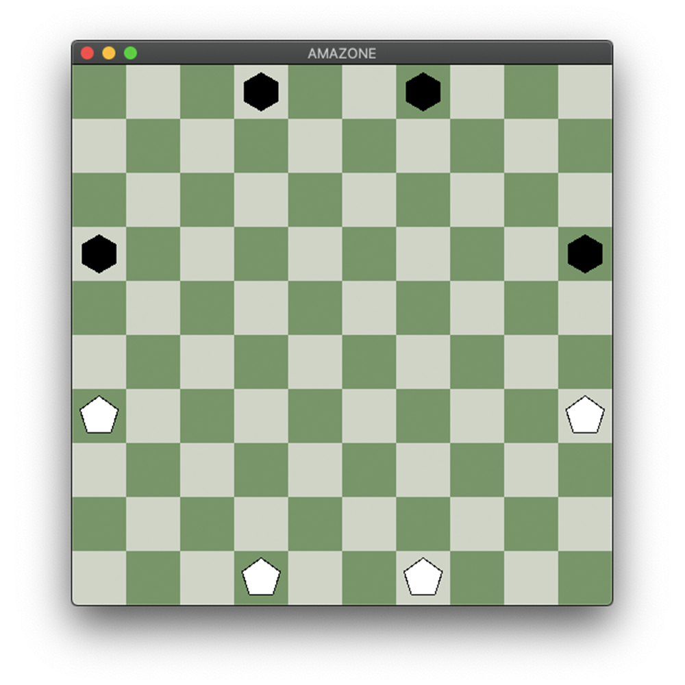
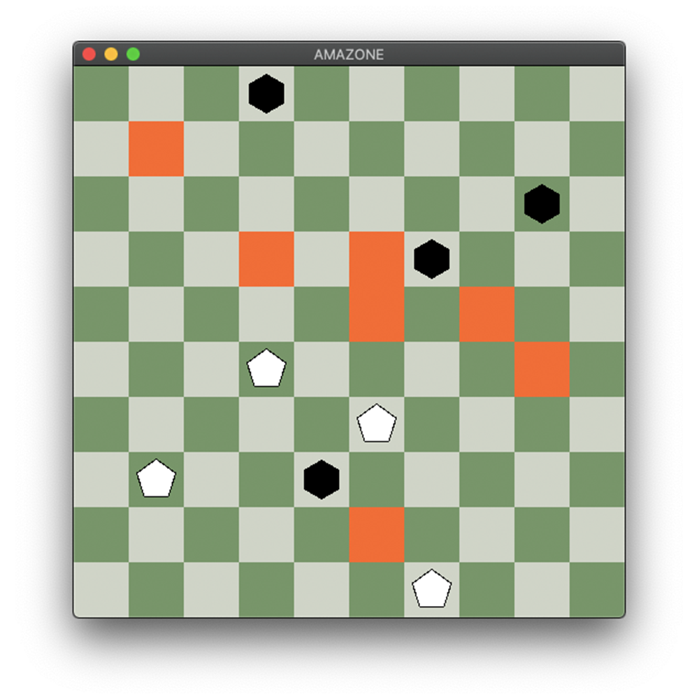
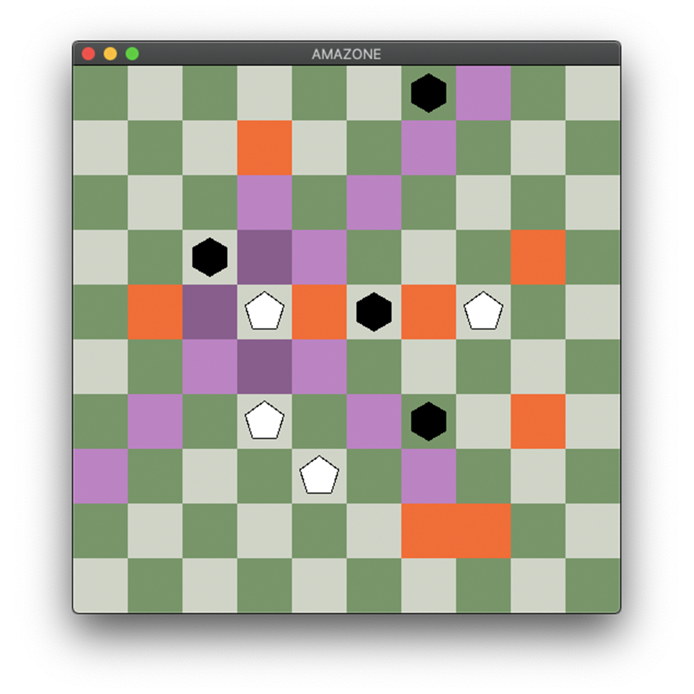

# AMAZONE
 This is the game "AMAZONE" !

# Dependencies

First you must install [SFML]( http://bit.ly/35BRjCS ).
Then clone this repository.
Finally: 
```
$ g++ -c Plateau.cpp main.cpp
$ g++ Plateau.o main.o -o main -lsfml-graphics -lsfml-window -lsfml-system
$ ./main
```

# Preview

|  |  |  |
| :------------------------------------: | :------------------------------------: | :------------------------------------: |
|           **Initial State**            |              **Midgame**               |            **Other Image**             |

# License
[MIT](https://choosealicense.com/licenses/mit/) License