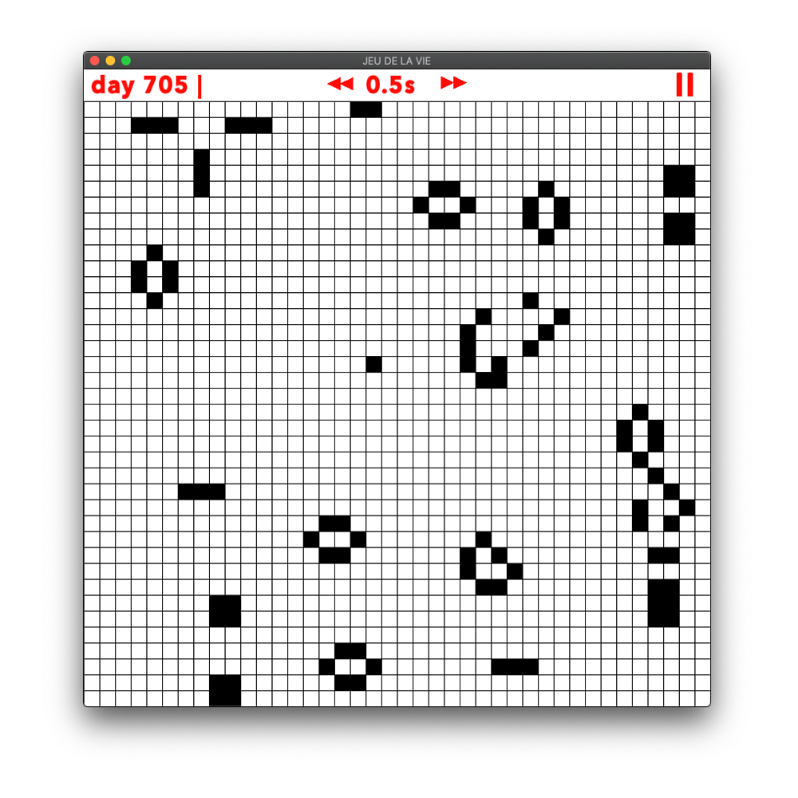
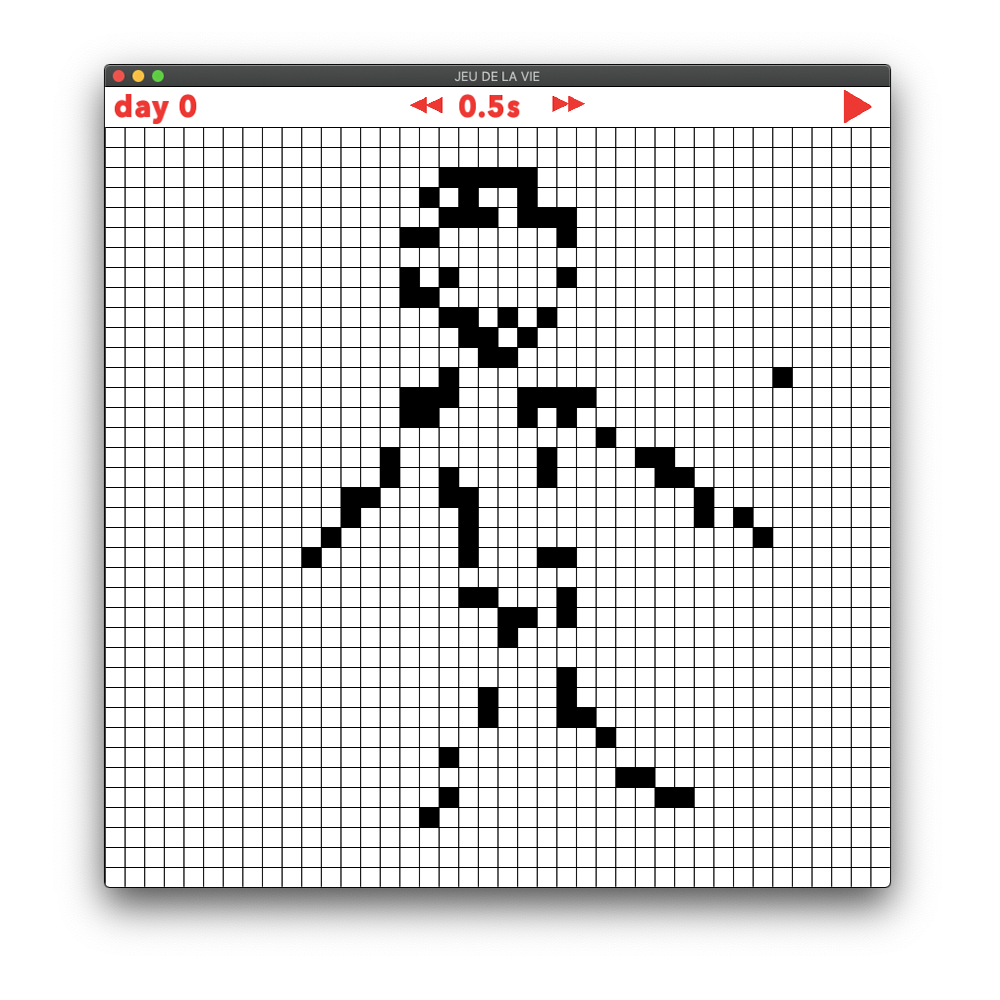

<<<<<<< HEAD
# Game Of Life (John Conway)
 This is an implementation of the [John Conway's Game Of Life](https://fr.wikipedia.org/wiki/Jeu_de_la_vie)

# Dependencies

First you must install [SFML]( http://bit.ly/35BRjCS ).
Then clone this repository.
Finally: 
```
$ g++ main.cpp -o main -lsfml-graphics -lsfml-window -lsfml-system
$ ./main
```

# Preview

|  |  |  |
| :------------------------------------: | :------------------------------------: | :------------------------------------: |
|           **Initial State**            |              **Example1**              |              **Example2**              |

# License
[MIT](https://choosealicense.com/licenses/mit/) License
=======
# Voici le [jeu de la vie](https://fr.wikipedia.org/wiki/Jeu_de_la_vie)

D'abord, installez la librairie [SFML]( http://bit.ly/35BRjCS )

Puis, dans le `terminal`:

Compilation:
```shell
  g++ main.cpp -o main -lsfml-graphics -lsfml-window -lsfml-system
```
  Exécution:
```shell
  ./main
```
  

>>>>>>> 33947bb45b7ac962ebf4c4d27346ff8cc87f8021
