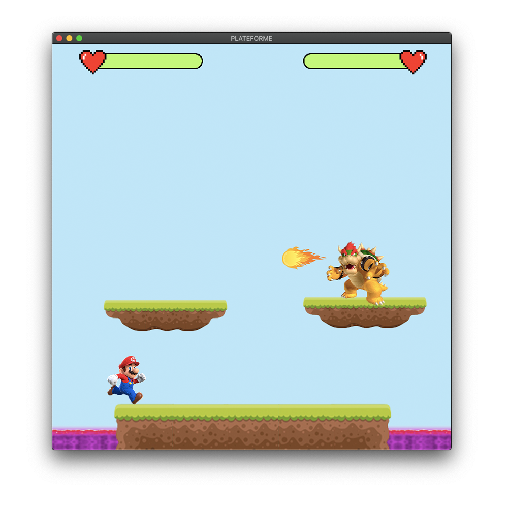

<<<<<<< HEAD
# Mario VS Bowser !
 This is the game "Mario VS Bowser" !

# Dependencies

First you must install [SFML]( http://bit.ly/35BRjCS ).
Then clone this repository.
Finally: 
```
$ g++ Plateau.o main.o -o main -lsfml-graphics -lsfml-window -lsfml-system
$ ./main
```

# Preview

|  |  |  |
| :------------------------------------: | :------------------------------------: | :------------------------------------: |
|             **Example 1**              |             **Example 2**              |             **Example 3**              |

# License
[MIT](https://choosealicense.com/licenses/mit/) License
=======
# Plateform_Fight

D'abord, installez la librairie [SFML]( http://bit.ly/35BRjCS )

Puis, dans le `terminal`:

Compilation:
```shell
 $   g++ main.cpp -o main -lsfml-graphics -lsfml-window -lsfml-system
```
  Exécution:
```shell
 $   ./main
```
  

>>>>>>> 33947bb45b7ac962ebf4c4d27346ff8cc87f8021
